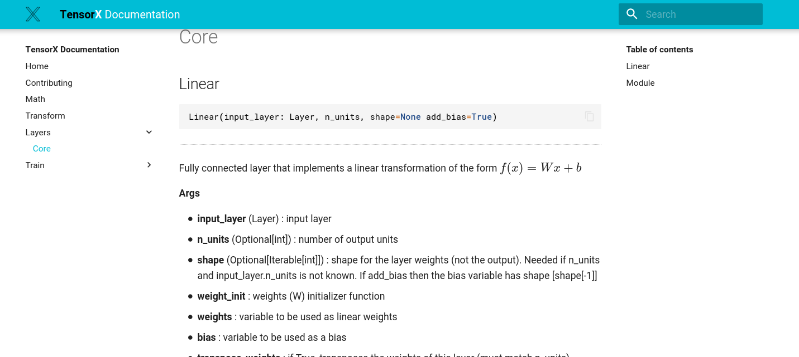

## mkgendocs
A Python package for automatically generating documentation pages in markdown for 
Python source files by parsing **Google style docstring**. The markdown output makes it
ideal to combine with [mkdocs](https://www.mkdocs.org/). 

Instead of executing the python code (using the `inspect` package to access signatures and docstrings), we extract the information directly from the source files by parsing them into Abstract Syntax Trees (AST) using the `ast` package. 

The `astor` (AST observe/rewrite) package is also used to convert function or class signatures from AST nodes back into source code strings.
 


## Installation
Install mkgendocs from [PyPI](https://pypi.org/project/mkgendocs/)

```python
pip install mkgendocs
```

## Usage

```
gendocs --config mkgendocs.yml
```

A sources directory is created with the documentation that was automatically generated.
Any examples in a "examples" directory are automatically copied over to the documentation, 
the module level docstrings of any example source files are also copied and converted to markdown. 


### Configuration Example

````yaml
sources_dir: docs/sources
templates_dir: docs/templates
repo: https://github.com/davidenunes/tensorx  #link to sources on github
version: master                               #link to sources on github

pages:
  - page: "api/train/model.md"
    source: "tensorx/train/model.py"
    methods:
      - Model:
          - train
          - set_optimizer
  
  - page: "api/layers/core.md"
    source: 'tensorx/layers.py'
    classes:
      - Linear:
        - compute_shape
      - Module
  - page: "math.md"
    source: 'tensorx/math.py'
    functions:
      - sparse_multiply_dense

  # creates an index page based on everything from target source
  - page: "api/layers/index.md"
    source: "tensorx/layers.py"
    index: True
````

* **sources_dir**: directory where the resulting markdown files are created
* **templates_dir**: directory where template files can be stored. All the folders and files are 
copied to the `sources_dir`. Any markdown files are used as templates with the 
tag `{{autogenerated}}` in the template files being replaced by the generated documentation.
* **repo**: repository to create `view source` links automatically for each class, function, and method;
* **version**: defaults to "master" to create link to sources in the form `https://repo/blob/version/file.py/#L1425`;
* **pages**: list of pages to be automatically generated from the respective source files and templates:
    * **page**: path for page template / sources dir for the resulting page;
    * **source**: path to source file from which the page is to be generated;
    * **classes**: list of classes to be fully documented; a list of method names can be passed for each class, the default is
      to generate all methods; 
    * **functions**: list of functions to be documented.
    * **index**: if True creates an index page for the given sources, you can also specify classes and functions, but not methods
  

## Buy me a coffee
If you find any of this useful, consider getting me some coffee, coffee is great!
<br/><br/>
<a href='https://ko-fi.com/Y8Y0RZO6' target='_blank'></a>
